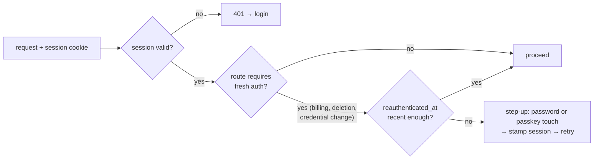
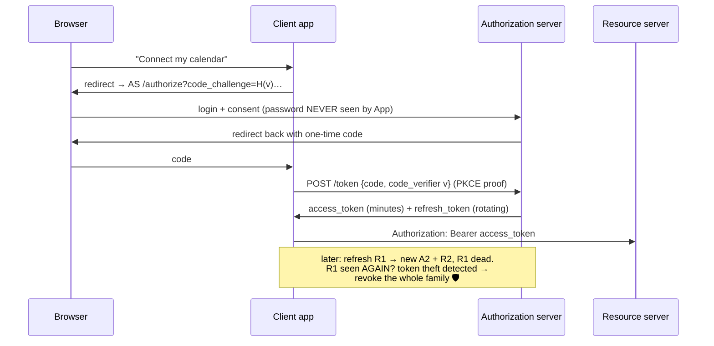
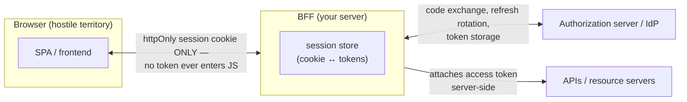
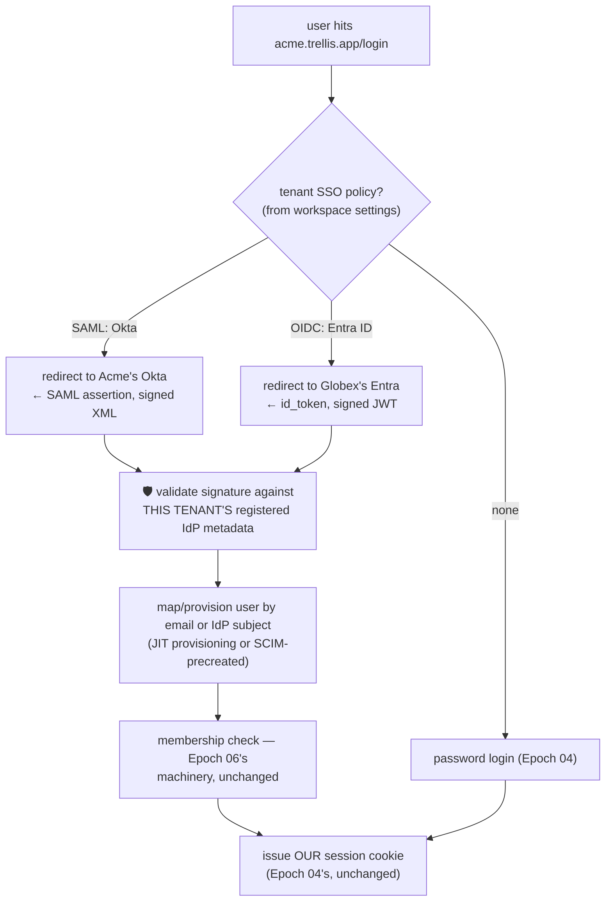

# Deep Dive 01 — Advanced Auth Architectures

> The course (Epoch 04) built the *foundation*: argon2, opaque hashed sessions, cookies, deny-by-default. This deep dive is the *skyline* — what auth becomes when a real B2B SaaS grows up: OAuth 2.1 and OIDC, the BFF pattern, refresh-token rotation, per-tenant enterprise SSO (SAML/OIDC), SCIM provisioning, MFA and passkeys, and machine-to-machine identity. Each section says **when you actually need it** — because premature identity infrastructure is one of the most expensive mistakes a startup can make.

---

## 1. The map: four kinds of "auth" that get conflated

| Problem | Question | Right-sized tool |
|---|---|---|
| **First-party login** | "Is this our user, in our browser?" | Sessions (Epoch 04) — full stop |
| **Delegated access** | "May this *third-party app* act on our user's behalf?" | OAuth 2.1 |
| **Federated identity** | "Our customer's *company* wants to control who logs in" | OIDC / SAML per-tenant SSO |
| **Machine identity** | "May this *service* call that *service*?" | client credentials, mTLS, workload identity |

The single most common architecture mistake is deploying the machinery of row 2–4 to solve row 1. **A single backend authenticating its own users does not need OAuth, JWTs, or an identity provider** — Epoch 04's session table is the correct, simpler, more revocable answer. Everything below exists for the moment one of the *other three rows* becomes true.

## 2. Sessions at scale: what changes and what doesn't

Epoch 04's design (opaque 256-bit token, SHA-256 at rest, `httpOnly`+`lax`+`secure` cookie, instant revocation) survives to very large scale with three additions:

- **Session store tiering.** The per-request lookup moves from Postgres to Redis when it shows up in p99 traces — same hashed-token model, now `GET session:<hash>` with a Postgres fallback as source of truth. (Don't do this preemptively: an indexed PK lookup is microseconds.)
- **Device/session inventory.** The sessions table grows `user_agent`, `ip_hash`, `last_seen_at` → the "active sessions" screen and "log out everywhere" button enterprise security reviews ask for. Server-side sessions make this a `SELECT` + `DELETE`; stateless tokens make it impossible.
- **Step-up authentication.** Sensitive actions (change email, delete workspace, billing) re-verify identity even inside a valid session: a `reauthenticated_at` timestamp on the session, checked by a `requireFreshAuth(maxAgeMinutes)` guard, satisfied by re-entering the password or an MFA touch. This is the pattern behind "confirm your password to continue."

## 3. OAuth 2.1 + OIDC: the delegation machinery, demystified

OAuth's core insight: the user should **never give their password to the third party**. Instead the third party is *redirected to* the identity holder, the user consents there, and the third party receives limited-scope, expiring **tokens**. OIDC is a thin identity layer on top (an `id_token` + `/userinfo` endpoint) that turns "access delegation" into "login."

The 2026 baseline is **OAuth 2.1**, which consolidates a decade of hard lessons into requirements:

- **Authorization-code flow with PKCE, always** — implicit flow is dead (tokens in URLs leak through history, referrers, logs); PKCE binds the code to the client that started the flow, killing code-interception attacks even for public clients.
- **Exact-match redirect URIs** — wildcard redirect matching was a standing account-takeover vector.
- **Refresh-token rotation, mandatory for public clients** — see below; per current guidance, every refresh issues a new refresh token and invalidates the old ([Okta's implementation notes](https://developer.okta.com/docs/guides/refresh-tokens/main/), [token-lifetime guidance](https://guptadeepak.com/ciam-compass/guides/token-lifetime-best-practices/)).

**Refresh rotation is a theft alarm, not just hygiene.** The rotation chain means a stolen refresh token gets one use at most before either the thief or the legitimate client trips the reuse detector — converting silent long-term compromise into a loud, revocable event. The operational subtlety is concurrency: multiple tabs and flaky mobile retries hit `/token` simultaneously, so production implementations need single-flight refresh in clients and a short server-side reuse grace window, or users get randomly logged out ([rotation best practices](https://www.loginradius.com/blog/identity/secure-refresh-token-rotation)).

## 4. The BFF pattern: how SPAs should hold tokens (they shouldn't)

The IETF's browser-app guidance ([draft-ietf-oauth-browser-based-apps](https://datatracker.ietf.org/doc/html/draft-ietf-oauth-browser-based-apps)) has converged on a blunt conclusion: **the browser is a hostile place to store tokens.** Any XSS reads `localStorage`; even in-memory tokens leak through injected code. The **Backend-for-Frontend (BFF)** pattern fixes this by construction:

The browser holds exactly one credential: an `httpOnly` session cookie — *which is Epoch 04's architecture*. The BFF holds the OAuth tokens server-side, does the refresh dance invisibly, and attaches access tokens to outbound API calls. XSS can still *use* the session while the page is open (nothing fixes that), but it can no longer *exfiltrate a reusable credential* — the difference between a bounded incident and a persistent compromise ([BFF vs token-mediating-backend](https://orchi.tech/en/blog/2026/03/30/oauth-2-0-for-browser-based-applications-bff-tmb/), [BFF pattern walkthrough](https://productdock.com/securing-your-web-apps-spring-security-oauth-2-0-bff-pattern/)).

**The unifying insight:** cookie sessions and OAuth aren't competing models. In a mature architecture, *the session is the browser-facing credential and OAuth tokens are backend-facing plumbing*. Trellis's Epoch 04 session layer is the front half of a BFF; bolting an OIDC client onto it later (section 5) completes it without re-architecting.

## 5. Enterprise SSO: per-tenant identity federation

The sales-blocking moment for every B2B SaaS: *"We'll sign the 500-seat contract when our employees can log in through Okta."* What that requires is architecturally different from consumer OAuth — **each tenant configures its own IdP**, and your app becomes a *service provider* federating against many authorities at once ([multi-tenant SSO architecture](https://ssojet.com/blog/multi-tenant-saas-and-single-sign-on), [enterprise SSO guide](https://www.loginradius.com/blog/identity/enterprise-sso-b2b-saas)):

- Acme authenticates via **Okta over SAML 2.0**
- Globex via **Microsoft Entra ID over OIDC**
- Initech via **Google Workspace**
- The long tail keeps email + password (Epoch 04)

Design rules that separate solid implementations from CVE generators:

1. **The IdP config is tenant data.** IdP metadata (certificates, issuer URLs, endpoints) lives in a tenant-scoped table. 🛡️ An assertion must validate against *the requesting tenant's* registered IdP — cross-tenant assertion acceptance ("any valid Okta token from anyone logs into anything") is the classic multi-tenant SSO vulnerability.
2. **Sessions stay yours.** SSO replaces *credential verification*, not session management. After the assertion validates, you issue your own cookie and everything downstream (tenancy, RBAC, revocation) is untouched. Never try to make the IdP's token your session.
3. **Domain-based IdP discovery needs verification.** "Emails @acme.com route to Acme's IdP" requires proving the tenant *owns* acme.com (DNS TXT challenge), or a hostile tenant registers your customer's domain and harvests their logins.
4. **SCIM is the other half of the contract.** Enterprises don't just want login — they want *deprovisioning*: employee leaves, access dies within minutes, everywhere. SCIM is a small REST API you expose (`/scim/v2/Users`, `/Groups`) that the tenant's IdP pushes create/update/deactivate events into — feeding exactly the memberships table from Epoch 06. Enterprise identity reviews treat SSO + SCIM + MFA + audit logs as one package ([enterprise identity components](https://ssojet.com/blog/enterprise-identity-management-for-saas)).
5. **Don't hand-roll SAML.** XML signature validation is a minefield (signature wrapping, comment injection, canonicalization bugs) with decades of CVEs. Use a maintained library or an SSO broker service; spend your innovation budget elsewhere ([OIDC and SAML integration patterns](https://ssojet.com/enterprise-ready/oidc-and-saml-integration-multi-tenant-architectures)).

## 6. MFA and passkeys: the 2026 posture

- **TOTP** (authenticator apps) is the floor: cheap, offline, universally understood. Store the seed encrypted, rate-limit attempts, provide recovery codes (hashed, single-use — they are credentials).
- **SMS is a deprecation target** — SIM-swapping made it the weakest second factor; acceptable only as a last-resort recovery path, ideally not even then.
- **Passkeys (WebAuthn)** are the direction of travel: phishing-resistant by construction (the credential is origin-bound — a lookalike domain gets nothing), and they can replace the password entirely rather than supplement it. The practical 2026 shape for B2B: consumer-style tenants get passkeys directly from you; enterprise tenants mostly get them *through their IdP* — when Entra/Okta enables passkeys, your SAML/OIDC integration inherits the benefit without new code, and IT keeps central provisioning/revocation, which they require ([passkeys for B2B SaaS](https://ssojet.com/blog/passkeys-for-b2b-saas-what-enterprise-customers-need)).
- **MFA is tenant policy, not user preference, in B2B.** Workspace admins set "MFA required"; the enforcement point is your auth gate (Epoch 04's hook), which checks the tenant's policy against the session's authentication strength — another reason sessions should record *how* they were established (`amr`: password? passkey? SSO? MFA?).

## 7. Machine-to-machine: services are users too

When Trellis grows service consumers (a CLI, partner integrations, internal services), humans-with-cookies stops fitting:

| Caller | Mechanism |
|---|---|
| Third-party server app | **Client credentials grant** — client_id + secret → short-lived access token; scopes limit blast radius |
| Tenant's script / integration | **API keys** — but built like sessions: hashed at rest, prefix-identifiable (`trellis_sk_…`), scoped, revocable, last-used-tracked, shown once |
| Your own service ↔ service | **mTLS or platform workload identity** (SPIFFE, cloud IAM) — identity from infrastructure, no long-lived secrets to leak |
| Webhooks you send | **HMAC signatures** (Epoch 09's `webhook-signature.ts`) — shared-secret authenticity without full PKI |

The recurring principle across all four rows is Epoch 04's, generalized: **long-lived secrets are stored hashed and revocable; anything that travels is short-lived; every credential is scoped to the least it needs.**

## 8. Build vs buy, honestly

Auth providers (Auth0, Clerk, WorkOS, Keycloak self-hosted, etc.) compress months of SAML/SCIM/passkey edge cases into an integration — and the market reflects that enterprise-auth-as-a-service is now the default first move for small teams ([B2B auth platform landscape](https://www.propelauth.com/post/6-best-auth-platforms-b2b-saas)). The honest decision axis:

- **Buy** when the need is *enterprise federation breadth* (SAML quirks across fifty IdPs, SCIM conformance) — undifferentiated, CVE-prone, contract-blocking work.
- **Build** the parts that touch your domain model: sessions, tenancy binding, RBAC, step-up rules. These integrate with *your* data and change with *your* product; outsourcing them creates an impedance mismatch you'll fight forever.
- The hybrid — own sessions + memberships (Epochs 04/06), delegate SAML/SCIM to a broker — is the most common steady state, and it's exactly the seam this course's architecture leaves open: the SSO flow in §5 terminates by issuing *our* session; who validated the assertion upstream is swappable.

## Sources

- [IETF: OAuth 2.0 for Browser-Based Applications](https://datatracker.ietf.org/doc/html/draft-ietf-oauth-browser-based-apps)
- [OAuth 2.0 BFF vs Token-Mediating-Backend](https://orchi.tech/en/blog/2026/03/30/oauth-2-0-for-browser-based-applications-bff-tmb/)
- [Spring Security OAuth 2.0 + BFF pattern](https://productdock.com/securing-your-web-apps-spring-security-oauth-2-0-bff-pattern/)
- [Refresh token rotation explained](https://www.loginradius.com/blog/identity/secure-refresh-token-rotation) · [Okta: refresh tokens & rotation](https://developer.okta.com/docs/guides/refresh-tokens/main/) · [Token lifetime best practices](https://guptadeepak.com/ciam-compass/guides/token-lifetime-best-practices/)
- [Multi-tenant SaaS and SSO](https://ssojet.com/blog/multi-tenant-saas-and-single-sign-on) · [OIDC and SAML in multi-tenant architectures](https://ssojet.com/enterprise-ready/oidc-and-saml-integration-multi-tenant-architectures) · [Enterprise SSO for B2B SaaS](https://www.loginradius.com/blog/identity/enterprise-sso-b2b-saas)
- [Enterprise identity management for SaaS](https://ssojet.com/blog/enterprise-identity-management-for-saas) · [Passkeys for B2B SaaS](https://ssojet.com/blog/passkeys-for-b2b-saas-what-enterprise-customers-need)
- [B2B auth platforms landscape](https://www.propelauth.com/post/6-best-auth-platforms-b2b-saas)
