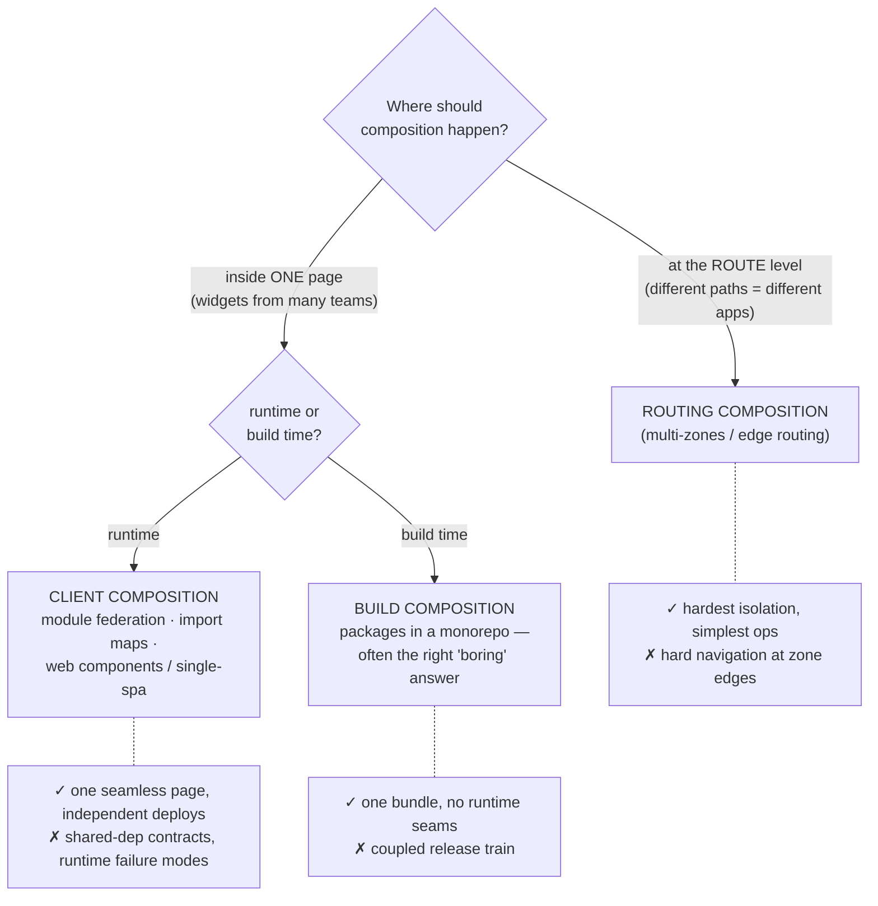
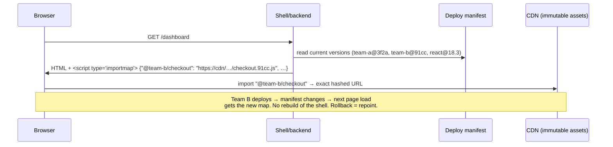

# Deep Dive 02 — The Backend's Job in a Microfrontend World

> Epoch 01 served one `public/` folder with a MIME table. This deep dive is what that job becomes when the "frontend" is **many independent UIs, built by different teams, on different release cadences, sometimes on different framework versions** — and the backend must serve, compose, cache, and version all of them without letting one team's deploy break another's. Assets, bundles, compilation output, package versioning, composition patterns, and the failure modes in between.

---

## 1. First, the honest question: do you need microfrontends?

Microfrontends solve an **organizational** problem — many teams needing independent deploys on one product surface — at a real **technical** cost: duplicated dependencies, cross-boundary UX seams, version-skew management, more infrastructure. The 2026 consensus is that they're a mainstream, mature option *for organizations at that scale*, not a default architecture ([microfrontends in 2026](https://buildifyer.com/en/blog/micro-frontends-scalable-web-architecture-guide-2026), [architecture options survey](https://danw1ld.medium.com/micro-frontend-architectures-what-are-your-options-adeae0829e53)). The same rule as Epoch 12's microservices verdict applies verbatim: **team scaling is the real reason; if one team owns the whole UI, a well-modularized monolithic frontend is strictly better.**

## 2. The backend's five jobs for any frontend, scaled to many

Whatever composition pattern you choose, the backend's contract is the same five jobs — each one an Epoch 01 lesson industrialized:

### 2.1 Immutable, content-hashed assets

Every modern bundler emits `app.3f2a9c.js` — the hash *is* the cache strategy:

```
/assets/app.3f2a9c.js   → Cache-Control: public, max-age=31536000, immutable
/index.html             → Cache-Control: no-cache   (the ONLY mutable entry point)
```

The HTML shell is the *pointer*; hashed assets are *values*. Deploys swap the pointer; CDNs keep every value forever. Two corollaries teams learn painfully:

- 🛡️ **Old asset versions must remain available after a deploy.** A user with yesterday's HTML open will lazy-load yesterday's chunk names for hours. Delete old chunks at deploy time and every open tab starts throwing `ChunkLoadError`. Keep N versions (or days) of assets live; clean up asynchronously.
- 🛡️ **`index.html` must never be cached as if immutable** — or users are pinned to dead chunk manifests indefinitely. This single misconfigured header is the most common self-inflicted frontend outage.

### 2.2 Version-skew handling

During any rolling deploy — and *permanently*, with independently-deployed microfrontends — **old frontends talk to new backends** (and vice versa). This is the frontend twin of Epoch 11's expand/contract:

- API changes are additive-first: new fields optional, old fields kept until no live bundle references them.
- The backend advertises a build id (header or `/version`); the frontend compares against its own and can prompt "a new version is available" or hard-reload on navigation.
- The catastrophic anti-pattern: renaming an API field and shipping backend + frontend "together" — there is no "together" once assets are CDN-cached and zones deploy independently.

### 2.3 The manifest: what's deployed right now?

With many UIs, "what version of everything is live?" needs a machine-readable answer — an **asset/zone manifest** (per team → current entry URL + hashed asset roots). It's the source of truth the router (§3) consumes, the deploy step updates atomically, and the rollback mechanism (repoint the manifest, don't rebuild). This is Epoch 02's "config quarantine" reborn at the frontend layer.

### 2.4 Origin services: compression, CSP, CORS boundaries

- Precompress at build (brotli) and serve `content-encoding` by `accept-encoding`; never gzip on the fly per-request on the Node process (CPU on the event loop — Epoch 00's oldest law).
- One `Content-Security-Policy` for the composed page — which becomes an *organizational* artifact with microfrontends: every team's asset origins, connect targets, and inline policies must merge into one header the shell owns. Treat CSP changes like schema migrations: reviewed, versioned, deployed with the shell.
- Cross-origin isolation between zones is a feature, not friction: it's what keeps Team A's XSS from reading Team B's DOM by default.

### 2.5 BFF-per-frontend

The Backend-for-Frontend pattern (deep-dive 01, §4) multiplies naturally: each sizable frontend gets a thin backend it owns — session-cookie auth at the edge, aggregation/shaping of core APIs, no business logic. Teams stop blocking on a shared API gateway team for every field, and the core services keep one clean contract. The discipline that keeps BFFs healthy: **they translate and aggregate; they never own domain data** (that's the repositories' job, one layer down, same as Epoch 03's route rule).

## 3. Composition patterns: the real decision



### 3.1 Routing composition (multi-zones)

Independent apps own **path prefixes** (`/`, `/dashboard`, `/docs`, `/blog`); a router in front — CDN rules, nginx, or the shell app's rewrites — maps prefixes to deployments. Each app is deployed, scaled, and even *framework'd* independently; crossing a zone boundary is a normal full-page navigation. This is the pattern with the best failure isolation and the least novel infrastructure, and in 2026 it's the mainstream first choice — the Next.js incarnation is covered in deep-dive 03 ([federation vs multi-zones in 2026](https://dotpingdesign.com/micro-frontends-2026-module-federation-multi-zones/)).

The backend work is exactly §2: per-zone asset namespaces (`/_assets/dashboard/*` vs `/_assets/docs/*` — collisions between zones' hashed files are a classic bug), per-zone manifests, and a routing layer that reads them.

### 3.2 Client-side composition: federation and import maps

When one *page* must contain multiple teams' code, someone must resolve "load Team B's checkout widget" *at runtime*:

- **Module Federation** (2.0 — now first-class in webpack, Rspack, and Vite) lets a host load remote bundles at runtime with **negotiated shared dependencies** ("both of us need react 18, load it once"). Mature but heavy machinery: the runtime dependency graph is assembled in the browser, and version negotiation is a contract that fails at runtime when violated ([Module Federation 2.0 production setup](https://medium.com/@chiragmehta900/micro-frontend-architecture-with-module-federation-2-0-production-setup-2026-602c3cd8fd04)).
- **Import maps + native ESM** are the platform-native alternative that 2026 has made viable (~95% browser support): the page ships a JSON map of bare specifiers → URLs, and the browser *is* the module loader. The backend's role gets crisp: **generate the import map from the deploy manifest** — pinning each team's module and each shared library to exact hashed URLs. Independent deploy = regenerate the map; rollback = repoint one entry ([import maps for microfrontends](https://www.angulararchitects.io/blog/import-maps-the-next-evolution-step-for-micro-frontends-article/), [lightweight alternative walkthrough](https://www.manuel-holzrichter.de/2026/02/28/from-monolith-to-micro-frontends-part-2/), [native federation comparison](https://dev.to/mhmoud_ashour_5547515422e/native-federation-vs-webpack-module-federation-which-should-you-choose-in-2026-109m)).



### 3.3 The failure modes unique to runtime composition

- **Shared-dependency drift** — Team A needs react 19, Team B is on 18: federation "singleton" conflicts or double-loaded frameworks. Mitigation is governance, not tooling: a platform team owns the shared-deps contract and its upgrade train.
- **A remote is down or 404s** (see §2.1's deleted-chunks trap, now cross-team): every remote load needs an error boundary and a degraded fallback — a missing widget must not white-screen the page. This is Epoch 08's "slow dependency" law wearing frontend clothes.
- **Global namespace bleed** — CSS and window globals cross boundaries unless disciplined (CSS modules/shadow DOM, no global mutation). Zones get this isolation free; in-page composition must earn it.

## 4. Package version management across many UIs

The dependency-coordination problem is where microfrontend programs actually die. The workable 2026 toolkit:

| Concern | Mechanism |
|---|---|
| Repo topology | **Monorepo + workspaces** (pnpm/turborepo/Nx) is the default: atomic cross-cutting changes, one lockfile audit surface (Epoch 11), shared CI caching. Polyrepo remains right when orgs are truly siloed — it trades coordination cost for autonomy |
| Shared UI/design system | Published as **versioned packages** consumed at build time — never runtime-federated "for freshness." SemVer discipline + a changesets-style release flow; breaking changes ride majors with codemods |
| Framework/runtime versions | A **platform-owned upgrade train**: allowed version ranges published centrally (the same manifest family as §2.3), teams upgrade within a window; CI fails builds outside the contract |
| Skew detection | Renovate/Dependabot per app + a dashboard of every app's key versions — drift you can see is drift you can schedule; drift you can't see is next quarter's incident |
| Contract testing | The API seams between shell ↔ remotes and BFF ↔ core get schema'd (typed SDKs generated from OpenAPI — Epoch 02's schemas cashing in again) so version skew fails in CI, not in prod |

The through-line from the whole course applies: **make the safe path the default path**. Exact-pinned lockfiles, generated import maps, manifest-driven routing, CI-enforced version contracts — each removes a class of human coordination the same way RLS removed the forgotten `WHERE`.

## Sources

- [Micro-frontends in 2026: federation vs Multi-Zones](https://dotpingdesign.com/micro-frontends-2026-module-federation-multi-zones/)
- [Module Federation 2.0 — production setup 2026](https://medium.com/@chiragmehta900/micro-frontend-architecture-with-module-federation-2-0-production-setup-2026-602c3cd8fd04)
- [Native Federation vs Webpack Module Federation in 2026](https://dev.to/mhmoud_ashour_5547515422e/native-federation-vs-webpack-module-federation-which-should-you-choose-in-2026-109m)
- [Import maps — the next evolution step for micro frontends](https://www.angulararchitects.io/blog/import-maps-the-next-evolution-step-for-micro-frontends-article/) · [Micro frontends with import maps, part 2](https://www.manuel-holzrichter.de/2026/02/28/from-monolith-to-micro-frontends-part-2/) · [Evolutionary progress with import maps](https://javascript-conference.com/blog/evolutionary-progress-with-import-maps/)
- [Micro-frontend architectures: options survey](https://danw1ld.medium.com/micro-frontend-architectures-what-are-your-options-adeae0829e53) · [Micro-frontends: scalable web architecture 2026](https://buildifyer.com/en/blog/micro-frontends-scalable-web-architecture-guide-2026)
