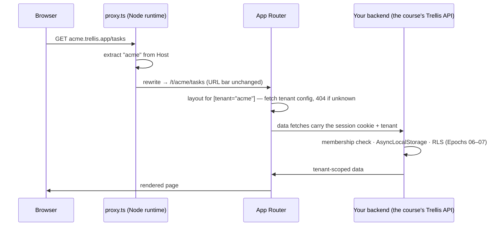
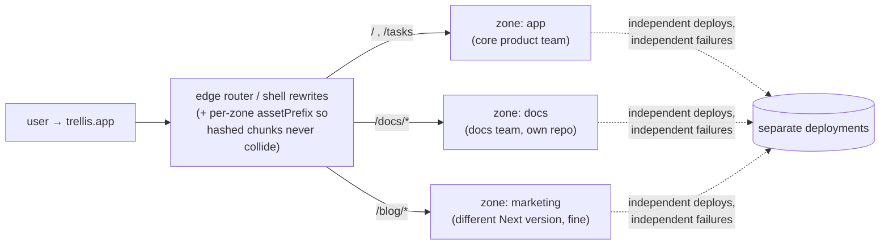
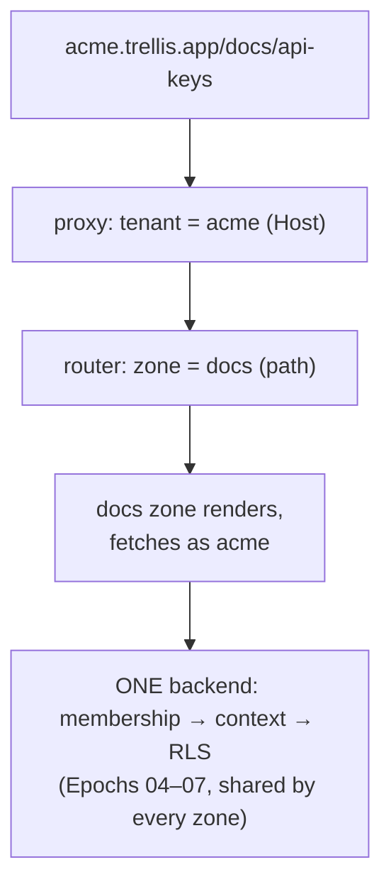

# Deep Dive 03 — What Modern Next.js Solves for Multitenancy & Microfrontends

> The course built a multi-tenant *backend* from first principles. This deep dive maps that knowledge onto the dominant full-stack React framework: what **Next.js 16** (current major as of 2026) actually provides for multi-tenant apps and microfrontend architectures, where the framework's machinery ends and *your* Epoch 06/07 responsibilities begin, and how Vercel's first-party microfrontends story changed the trade-off table.

---

## 1. Next.js 16 in one paragraph (what changed that matters here)

Next.js 16 refined rather than reinvented: **Cache Components** replace the old implicit caching heuristics with an explicit, opt-in model — everything renders dynamically by default, and you mark cacheable islands with the `use cache` directive, paired with Partial Pre-Rendering so one page can mix static shell and dynamic holes ([Next.js 16 release notes](https://nextjs.org/blog/next-16), [LogRocket's overview](https://blog.logrocket.com/next-js-16-whats-new/)). And **`proxy.ts` replaces `middleware.ts`** as the request-interception point — explicitly Node.js-runtime (no more edge-runtime constraints), making the app's network boundary a first-class, predictable file ([upgrade guide](https://nextjs.org/docs/app/guides/upgrading/version-16), [proxy/cache guide](https://www.nandann.com/blog/nextjs-16-2-complete-guide)). Both changes matter directly below: caching semantics are where multi-tenant leaks happen, and the proxy is where tenants are resolved.

## 2. Multitenancy in Next.js: what the framework gives you

### 2.1 The canonical pattern: subdomain → rewrite → route group

Next.js's contribution to multitenancy is **routing-layer tenant resolution** — the same subdomain strategy as Epoch 06, implemented in `proxy.ts` and the App Router. The reference implementation is Vercel's Platforms starter, updated for Next.js 16 ([vercel/platforms](https://github.com/vercel/platforms), [Vercel multi-tenant docs](https://vercel.com/docs/multi-tenant)):

```ts
// proxy.ts (Next.js 16 — the middleware.ts successor)
export default function proxy(req: NextRequest) {
  const host = req.headers.get("host")!;
  const tenant = extractSubdomain(host);        // "acme.trellis.app" → "acme"
  if (tenant) {
    // internal rewrite — the URL bar stays acme.trellis.app/tasks
    return NextResponse.rewrite(
      new URL(`/t/${tenant}${req.nextUrl.pathname}`, req.url)
    );
  }
}
```

```
app/
├── t/[tenant]/          ← every tenant page lives under one dynamic segment
│   ├── layout.tsx       ← loads tenant config, 404s unknown tenants
│   └── tasks/page.tsx   ← reads params.tenant
└── (marketing)/         ← apex-domain pages: landing, signup, docs
```



What the framework machinery handles: wildcard-subdomain routing across localhost/preview/production environments, one codebase serving every tenant, per-tenant static generation of marketing-style pages, custom-domain mapping (a tenant's `tasks.acme.com` CNAMEs onto the platform and resolves to the same rewrite) ([subdomain routing pattern guides](https://www.peal.dev/blog/multi-tenant-subdomain-routing-nextjs-patterns), [Kite Metric's guide](https://kitemetric.com/blogs/mastering-subdomain-routing-in-next-js-for-multi-tenant-applications)).

### 2.2 What the framework does NOT handle — the course's territory

This is the sharpest lesson of the whole deep dive: **Next.js resolves *which tenant was requested*; it says nothing about *whether the data layer honors that*.** Community guidance now states it plainly: if your data layer isn't tenant-aware by default, you will eventually serve one tenant's data to another — RLS in Postgres or an always-filtering service layer is the fix ([multi-tenant architecture guide](https://medium.com/@itsamanyadav/multi-tenant-architecture-in-next-js-a-complete-guide-25590c052de0), [Next.js 16 SaaS blueprint](https://medium.com/@sureshdotariya/next-js-16-architecture-blueprint-for-large-scale-applications-build-scalable-saas-multi-tenant-ab0efe9f2dad)). Mapped to the course:

| Layer | Next.js provides | You still build (= Epochs 04–07, unchanged) |
|---|---|---|
| Tenant *naming* | subdomain/domain → route rewrite | — |
| Tenant *authorization* | — | membership JOIN: URL is a claim, the DB row is the grant |
| Data isolation | — | `tenant_id` columns, scoped repos, **RLS** |
| Session security | — | hashed opaque sessions, cookie flags, deny-by-default |
| **Cache isolation** | explicit `use cache` boundaries | 🛡️ **tenant id in every cache key** |

That last row is the Next-specific trap: server-side caching (`use cache`, memoized fetches, ISR pages) is *shared across requests* — cache a tenant-scoped query result without the tenant in the key, and Acme's cached dashboard is served to Globex. Next 16's explicit model genuinely helps here — caching now happens only where you wrote it, so every `use cache` site is a reviewable "is this keyed by tenant?" checkpoint — but the discipline is still yours, and it is exactly Epoch 08 §8.5's rule transplanted into the framework.

**Verdict:** Next.js is an excellent *tenant-aware frontend/BFF tier* for the architecture this course built. It replaces none of the backend's isolation machinery; it sits in front of it, terminating sessions (deep-dive 01's BFF pattern) and forwarding tenant-scoped requests.

## 3. Microfrontends in Next.js: the 2026 answer is Multi-Zones

### 3.1 What Multi-Zones are

**Multi-Zones** deploy several independent Next.js apps that present as one site: each zone owns path prefixes, deploys on its own cadence, and a routing layer (the shell app's rewrites, or Vercel's edge) maps paths to deployments — deep-dive 02's "routing composition," productized ([Vercel multi-zones template](https://vercel.com/templates/next.js/microfrontends-multi-zones), [hands-on walkthrough](https://thayto.com/en/blog/microfrontends-next-js-multi-zones)):



The 2026 upgrade is that this stopped being a DIY rewrite-map exercise: Vercel ships a first-party **`@vercel/microfrontends`** package with App Router support — a `withMicrofrontends` config, a cross-zone `Link` component, and cross-zone prefetching so navigation between independently-deployed apps approaches soft-navigation smoothness, addressing the pattern's historical weakness (hard navigations at zone edges) ([vercel-labs multi-zone example](https://github.com/vercel-labs/microfrontends-nextjs-app-multi-zone), [official examples](https://github.com/vercel/examples/tree/main/microfrontends/nextjs-multi-zones), [Next.js 16 multi-zone setup](https://vijayasekhar-deepak.medium.com/next-js-16-micro-frontends-with-multi-zone-local-setup-part-1-4846fbce4b3d)).

### 3.2 Why Module Federation lost in the Next.js ecosystem

Runtime federation never fit Next.js: it fights the server-rendering pipeline, the router's prefetch model, and the framework's build assumptions — the community's 2026 assessment is blunt about federation being a migration *source*, with Multi-Zones as the destination, because most teams' actual requirement was independent ownership + deployment, not runtime chunk sharing ([the 2026 migration path](https://medium.com/@yashnigam.p/module-federation-is-a-dead-end-for-next-js-heres-the-2026-migration-path-36090738cedb), [federation vs multi-zones](https://dotpingdesign.com/micro-frontends-2026-module-federation-multi-zones/)). The honest decision table:

| Need | Right tool |
|---|---|
| Teams own separate *sections* (routes) of one product | **Multi-Zones** — take the boring win |
| Many teams' widgets on the *same page*, independently deployed | Runtime composition (federation / import maps) — accept the §3.3 costs from deep-dive 02, likely *outside* Next.js's render pipeline (client-only islands) |
| One team, one app, wants modularity | Neither — packages in a monorepo (build-time composition) |
| Shared header/design-system across zones | Versioned package consumed at build time by each zone — never runtime-injected |

### 3.3 Multitenancy × microfrontends, combined

The two dimensions compose cleanly because they occupy different axes: **tenancy is resolved at the edge before zone routing** (subdomain → tenant; path → zone), and every zone forwards the same session cookie to the same backend:



The invariant to protect: 🛡️ **auth and tenancy live in one place** (the shared backend / a shared auth service + cookie domain), never re-implemented per zone — cookie domain scoped to the apex (`.trellis.app`) so every zone and subdomain sees the same session, with each zone treating the cookie exactly as the course's auth gate does. Zones multiply *frontends*; they must not multiply *identity systems*.

## 4. The course's architecture, with Next.js in the picture

Where everything lands if Trellis adopts a Next.js frontend tomorrow:

- **Keep:** the entire Fastify backend — sessions (04), memberships + context (06), RLS (07), jobs (09), observability (10). Every guarantee lives below the frontend and survives any frontend swap. That portability was the point of building it right.
- **Add:** Next.js as the BFF/rendering tier — `proxy.ts` does subdomain → rewrite; server components call the backend with the forwarded cookie; `use cache` islands are tenant-keyed.
- **Split later, if team scale demands:** zones along team seams, `@vercel/microfrontends` for routing/prefetch, one shared identity + data plane underneath — the frontend twin of Epoch 12's modular-monolith-first roadmap.

## Sources

- [Next.js 16 release](https://nextjs.org/blog/next-16) · [Next.js 16 upgrade guide](https://nextjs.org/docs/app/guides/upgrading/version-16) · [LogRocket: what's new in Next.js 16](https://blog.logrocket.com/next-js-16-whats-new/) · [Next.js 16.2: use cache, Turbopack, proxy API](https://www.nandann.com/blog/nextjs-16-2-complete-guide)
- [vercel/platforms — multi-tenant Next.js starter](https://github.com/vercel/platforms) · [Vercel for Platforms docs](https://vercel.com/docs/multi-tenant)
- [Multi-tenant subdomain routing: the complete pattern](https://www.peal.dev/blog/multi-tenant-subdomain-routing-nextjs-patterns) · [Kite Metric: subdomain routing guide](https://kitemetric.com/blogs/mastering-subdomain-routing-in-next-js-for-multi-tenant-applications) · [Multi-tenant architecture in Next.js](https://medium.com/@itsamanyadav/multi-tenant-architecture-in-next-js-a-complete-guide-25590c052de0) · [Next.js 16 SaaS architecture blueprint](https://medium.com/@sureshdotariya/next-js-16-architecture-blueprint-for-large-scale-applications-build-scalable-saas-multi-tenant-ab0efe9f2dad)
- [Vercel Multi-Zones starter](https://vercel.com/templates/next.js/microfrontends-multi-zones) · [@vercel/microfrontends multi-zone example](https://github.com/vercel-labs/microfrontends-nextjs-app-multi-zone) · [vercel/examples: nextjs-multi-zones](https://github.com/vercel/examples/tree/main/microfrontends/nextjs-multi-zones) · [Next.js 16 micro-frontends with multi-zone](https://vijayasekhar-deepak.medium.com/next-js-16-micro-frontends-with-multi-zone-local-setup-part-1-4846fbce4b3d)
- [Module Federation is a dead end for Next.js — the 2026 migration path](https://medium.com/@yashnigam.p/module-federation-is-a-dead-end-for-next-js-heres-the-2026-migration-path-36090738cedb) · [Micro-frontends in 2026: federation vs Multi-Zones](https://dotpingdesign.com/micro-frontends-2026-module-federation-multi-zones/) · [Micro frontends with Next.js Multi Zones](https://thayto.com/en/blog/microfrontends-next-js-multi-zones)
