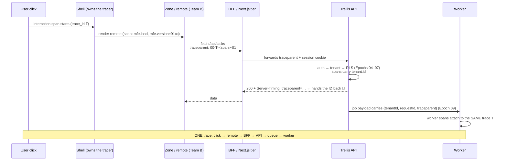
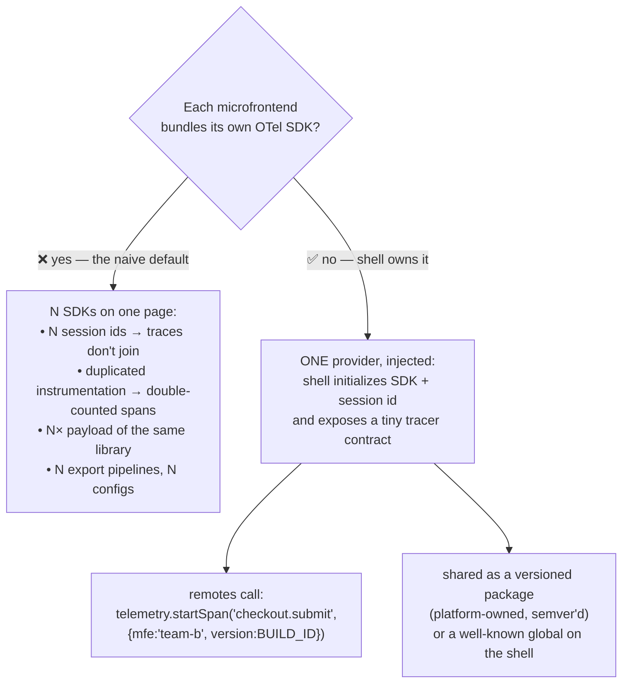
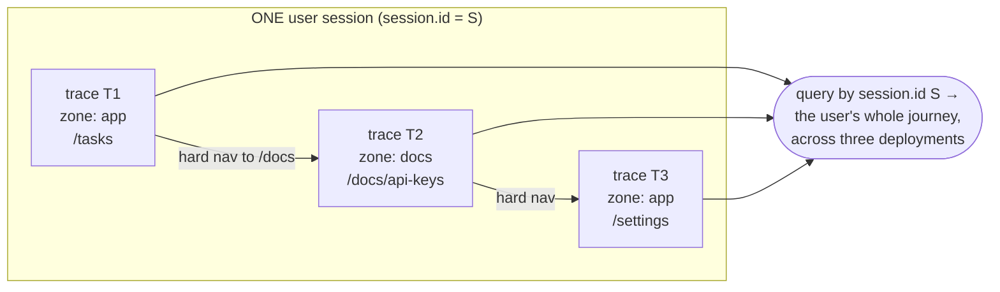
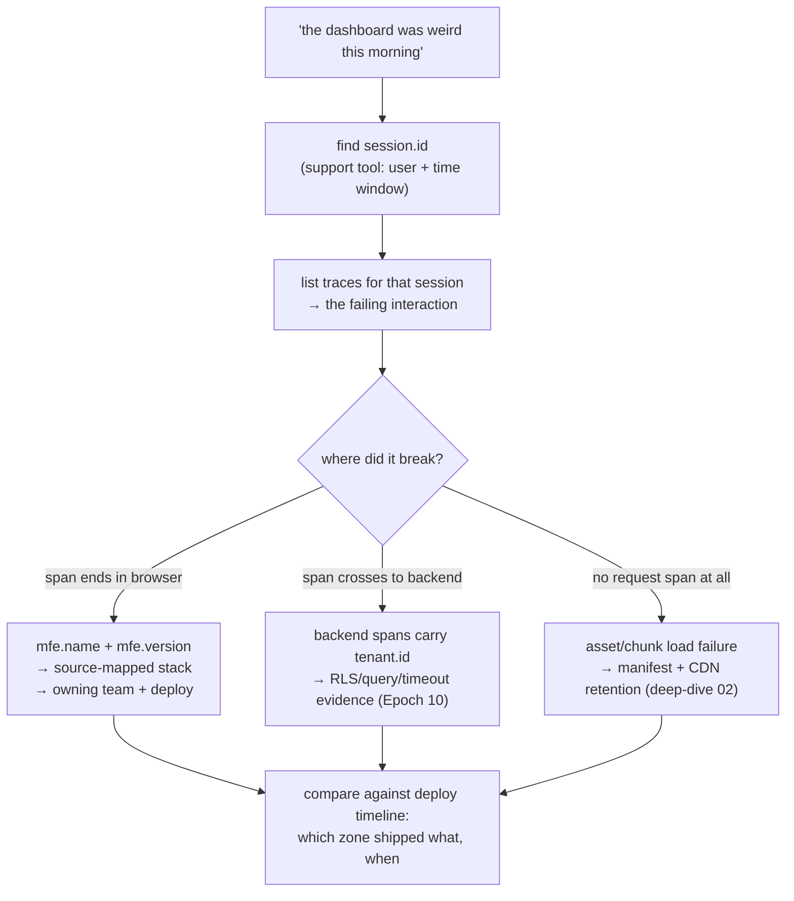

# Deep Dive 04 — Observability Across the Frontend Boundary

> Epoch 10 gave the backend three pillars and one join key (`reqId` + `tenantId` on every log line and span). This deep dive extends that thread **one hop upstream, into the browser** — and then across *many independently-deployed frontends*. The question it answers: a user says "the dashboard was weird this morning." Which team's bundle, which build, which backend call, which tenant? Answering that in one query instead of one afternoon is what this document is about.

---

## 1. The pain, in microfrontend shape

With a monolithic frontend, "the frontend is broken" has one owner. With zones and remotes, a single page is a *federation of deployments* — and the failure reports arrive without attribution:

- The shell renders, but Team B's checkout widget silently doesn't. No error in your backend logs — the widget's chunk 404'd because Team B's deploy pruned old assets.
- A user's action fails. Team A's console shows a rejected fetch; the backend shows a clean 200 to a *different* endpoint. Nobody can tell whether the request even left the browser.
- p99 backend latency is flat, but users report "slow" — the time went into a remote bundle downloading over a cold cache, which no server-side metric can see.
- An error lands in your tracker as `at t(app.3f2a9c.js:1:48210)` — minified, un-attributed, un-versioned. Useless.

Every one of those is the **same missing thing**: no identity thread linking browser events to server events, and no attribution of a browser event to the *microfrontend and build* that produced it.

## 2. The join keys: what every browser signal must carry

Epoch 10's discipline generalizes. In a microfrontend world, five attributes turn isolated signals into a queryable system. Fix this schema *before* choosing any vendor:

| Attribute | Why it's load-bearing |
|---|---|
| `trace_id` / `span_id` (W3C) | Links a browser interaction to the exact backend spans it caused |
| `session.id` | Survives page loads — the **only** continuity across hard navigations between zones (§5) |
| `mfe.name` + `mfe.version` | Attributes the signal to a team and a *specific build hash* — "which deploy did this?" |
| `tenant.id` | Same reason as Epoch 10: "everyone, or just Acme?" is still the first triage question |
| `route` / `interaction` | Aggregation dimension: which screen, which action |

🛡️ **`user.id`/`tenant.id` in browser telemetry is PII flowing to a third party.** Send opaque internal ids, never emails or names, and strip query strings from captured URLs (password-reset tokens, invite tokens, and session tokens all live in URLs somewhere). This is Epoch 10's central-redaction rule, enforced at the collector (§6) because you cannot audit every call site across N teams.

## 3. Context propagation: how the browser joins the trace

The mechanism is **W3C Trace Context** — the same `traceparent`/`tracestate` headers OpenTelemetry already uses between your services, now originating one layer earlier. The browser SDK's fetch/XHR instrumentation injects them into outgoing requests, and your backend's auto-instrumentation extracts them as the parent span ([browser instrumentation for RUM](https://oneuptime.com/blog/post/2026-02-06-opentelemetry-browser-instrumentation-real-user-monitoring/view), [frontend↔backend context propagation](https://oneuptime.com/blog/post/2026-02-06-context-propagation-frontend-backend/view)).

Three mechanics that decide whether this works in practice:

1. **CORS.** `traceparent` is a non-safelisted header: cross-origin requests to your API now trigger a **preflight**, and the API must return `Access-Control-Allow-Headers: traceparent, tracestate`. Miss this and the browser blocks the request outright — instrumentation that *breaks* the app is the classic first-day failure ([cross-origin requirements](https://oneuptime.com/blog/post/2026-01-07-opentelemetry-browser-frontend/view)). Configure a **propagation allowlist** so headers are injected only toward your own origins — never toward third-party APIs, where you'd leak internal trace ids.
2. **`Server-Timing` for the reverse direction.** Backends can return the trace id to the page, letting RUM link a slow *user-perceived* interaction to the *server* trace even when the browser didn't start it. Cheap, and it makes support tickets self-serve.
3. **Same-origin telemetry endpoint.** Ship browser spans to a path on your own domain (`/v1/traces` proxied to your collector), not directly to a vendor host: ad-blockers and strict CSPs eat third-party beacon calls, and you avoid another preflight. The collector then forwards onward.

## 4. Who owns the tracer? (the microfrontend-specific decision)

This is the question no single-app tutorial answers, and getting it wrong is expensive:

**Rule: the shell owns the SDK, the session, the exporter, and the redaction policy; remotes own only their span *names and attributes*.** The contract between them is a thin, stable interface — deliberately small so it almost never breaks across independent deploys. Practically:

- The shell initializes the tracer *before* any remote loads, mints `session.id`, and sets global resource attributes (`tenant.id`, `deployment.environment`).
- Each remote injects its own `mfe.name` / `mfe.version` (its build hash, compiled in at build time) into every span and error it reports.
- Zones (separate documents, §5) each initialize the SDK from the *same shared package with the same config*, and stitch by `session.id` rather than sharing a provider — different page, different JS realm.

## 5. The hard part: continuity across hard navigations

A trace, by definition, dies at a page load. In routing-composed architectures (multi-zones, deep-dive 02/03), *crossing a team boundary is a page load* — so traces fragment exactly where you most need continuity.

The techniques that keep the story readable:

- **`session.id` in `sessionStorage`**, minted by the shell's shared package, read identically by every zone. It is the join key that outlives navigations. (Not `localStorage` — you want per-tab semantics and natural expiry.)
- **Span links, not parents**, across the boundary: the new page's root span carries a link to the previous navigation's trace id (passed via `sessionStorage`), so tooling can walk the chain without lying about causality.
- **Navigation timing as a first-class span** (`document-load` instrumentation): a zone transition that takes 2.5s because a cold bundle downloaded is *the* microfrontend performance failure mode, and it only exists in browser data.

## 6. The collector: the one place to enforce policy

Never let N frontend teams each configure exporting. Put an **OpenTelemetry Collector** between the browser and your backend, and make it the single enforcement point — the frontend twin of "redaction lives in the logger config":

- **Redaction/PII scrubbing** — strip query strings, drop unexpected attributes by allowlist, hash anything user-identifying.
- **Sampling** — 🛡️ head-sampling in the browser is a trap: at 10% you throw away 90% of the errors *before you know which sessions matter*. Prefer keeping everything the page produces (it's cheap; interactions are rare compared to server requests) and doing **tail-based sampling in the collector**: always keep traces with errors, slow interactions, or a flagged tenant; downsample the boring ones.
- **Cardinality control** — route templates, not raw URLs (`/tasks/:id`, never `/tasks/7ab…`). Epoch 10's top-N-tenants rule applies verbatim.
- **Vendor independence** — swap backends without touching a single frontend deploy.

## 7. Making stack traces useful: source maps + build ids

An error report is only actionable if you can map minified frames back to source *for the exact build that produced them*:

1. Bundlers emit `mfe.version` = the content hash/build id; compile it into the bundle (`__BUILD_ID__`) so every span and error carries it.
2. CI uploads source maps to your error tracker/collector **keyed by that build id** — and 🛡️ does *not* deploy them to the public CDN (source maps hand your source to anyone who asks).
3. Retention must exceed asset retention: users run old bundles for days (deep-dive 02 §2.1), so keep maps for every build still reachable.

Now `at t(app.3f2a9c.js:1:48210)` resolves to `apps/checkout/src/submit.ts:42` in **Team B's build 3f2a9c**, which the deploy manifest says shipped at 09:14 — and the "which deploy broke it?" question answers itself.

## 8. Errors and Web Vitals, attributed by owner

- **Error boundaries per microfrontend** — every remote renders inside one that (a) degrades gracefully, never white-screening the page, and (b) reports with `mfe.name`/`mfe.version` attached. Without per-boundary attribution, one team's exception looks like everyone's outage. This is Epoch 08's "a slow/broken dependency must fail in a bounded way," applied to UI composition.
- **Core Web Vitals per zone and per mfe** — LCP/INP/CLS attributed to the owning team; unattributed vitals mean nobody owns performance and it degrades by default.
- **A "frontend RED"**: per mfe, per route → interaction rate, error rate, interaction duration (p75/p99). Same shape as Epoch 10's backend RED, same first triage question ("everyone, or just this tenant / this build?").

## 9. The triage playbook

What all of the above buys — a deterministic path from a vague report to a named commit:

Three rules keep this playbook alive: **alert on symptoms, not causes** (Epoch 10 — page on user-visible error rate and INP, dashboard the bundle sizes); **every alert names an owner** (the `mfe.name` dimension is what makes routing possible); and **deploy markers on every dashboard**, per zone — with independent deploys, "what changed?" is the first question and it has N possible answers.

## Sources

- [OpenTelemetry browser instrumentation for RUM](https://oneuptime.com/blog/post/2026-02-06-opentelemetry-browser-instrumentation-real-user-monitoring/view) · [OTel browser instrumentation for frontend observability](https://oneuptime.com/blog/post/2026-01-07-opentelemetry-browser-frontend/view) · [Context propagation between frontend and backend](https://oneuptime.com/blog/post/2026-02-06-context-propagation-frontend-backend/view)
- [Elastic: web frontend instrumentation with OpenTelemetry](https://www.elastic.co/observability-labs/blog/web-frontend-instrumentation-with-opentelemetry) · [Elastic: OpenTelemetry for RUM](https://www.elastic.co/docs/solutions/observability/applications/otel-rum)
- [Splunk: manually instrument browser applications](https://help.splunk.com/en/splunk-observability-cloud/manage-data/instrument-front-end-applications/instrument-mobile-and-web-applications-for-splunk-real-user-monitoring-rum/instrument-browser-applications-for-splunk-rum/manually-instrument-browser-based-web-applications) · [Last9: getting started with OTel browser monitoring](https://last9.io/blog/getting-started-with-opentelemetry-for-browser-monitoring/) · [Dash0: what is frontend monitoring](https://www.dash0.com/faq/what-is-frontend-monitoring)
