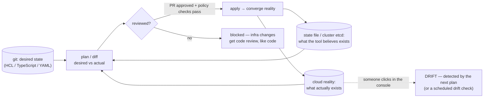
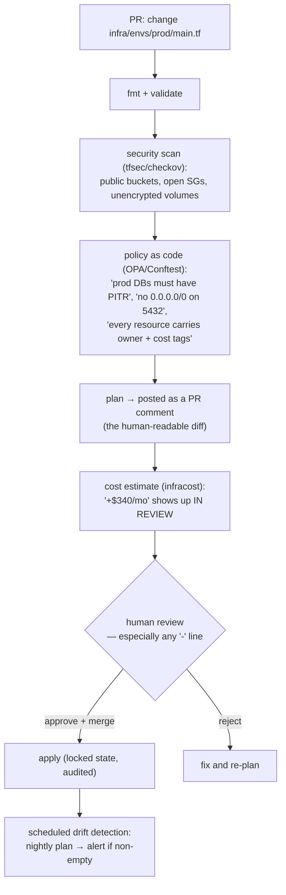
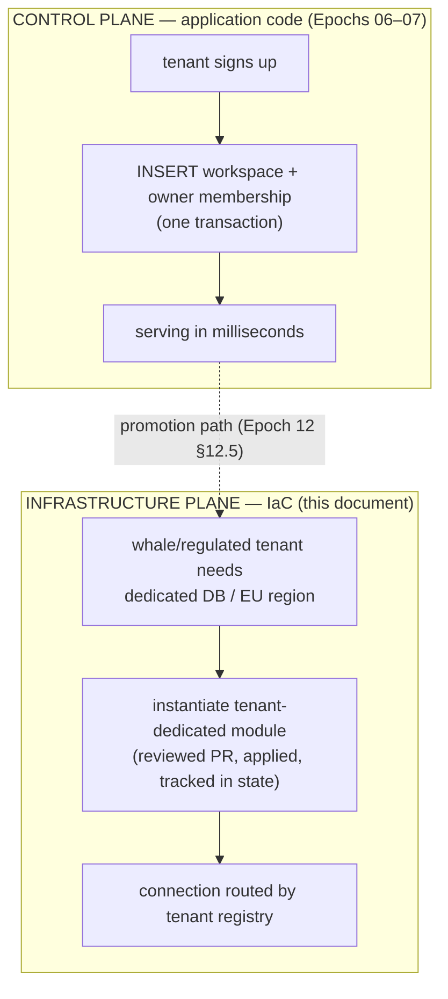

# Deep Dive 05 — Infrastructure as Code

> Epoch 11 shipped a container and a CI pipeline. But the *environment* that container lands in — networks, databases, secrets, DNS, queues, the CDN — was still implicitly hand-made. This deep dive closes that gap: infrastructure expressed as reviewed, versioned, reproducible code. The through-line is the course's oldest principle, applied one layer down: **make the safe path the default path, and make "what is actually running?" answerable from git.**

---

## 1. The pain

The architecture is correct, tested, observable — and it lives on a server someone configured by clicking. Symptoms, all of which arrive eventually:

- **The snowflake.** Staging behaves differently from production and nobody knows every difference. Bugs are unreproducible by construction.
- **The bus factor.** One person knows why that security group allows that port. They're on holiday during the incident.
- **The un-rebuildable environment.** A region outage, or a compromised account, means recreating production from memory under maximum stress.
- **Silent drift.** Someone "temporarily" bumps a setting in the console at 3am. Six months later a deploy resets it and an outage nobody can explain.
- **Untestable change.** "Will this firewall change break anything?" has no answer short of trying it in production.

IaC answers all five the same way version control answered them for application code — and the industry took twenty years longer to accept it for infrastructure than for source.

## 2. The mental model: desired state + reconciliation

The core idea is **declarative**: you describe *what should exist*, a tool computes the diff against *what does exist*, and applies the difference. Not "run these 40 commands in this order" (imperative, unrepeatable, order-dependent) but "this VPC, this database at this size, this DNS record" — and the tool figures out create/update/delete.



Two consequences worth internalizing:

- **The plan is the review artifact.** `terraform plan` output in a PR is to infrastructure what a diff is to code. "Will this break anything?" becomes a readable list of `+`, `~`, and — the dangerous one — `-`.
- **State is precious and sensitive.** The state file records real resource ids *and often secret values/outputs*. It lives in remote, encrypted, access-controlled storage with **locking** (two concurrent applies corrupt state), never in the repo. Losing state doesn't destroy infrastructure, but it does destroy the tool's ability to manage it — recovery is import-by-hand, an afternoon you don't want.

## 3. ⚖️ Choosing tools (and the 2026 landscape)

| | **OpenTofu** | Terraform | Pulumi | Crossplane | Cloud-native CDKs |
|---|---|---|---|---|---|
| Language | HCL (declarative) | HCL | TS/Python/Go/C# | Kubernetes CRDs | TS/Python (synth to CFN/TF) |
| Governance | Linux Foundation, open source | HashiCorp/IBM, BUSL since 2023 | Company + OSS | CNCF | Cloud vendor |
| State | file (remote backend) | file (remote backend) | managed or self-hosted | etcd (the cluster *is* the state) | vendor-managed |
| Sweet spot | Terraform-compatible, license-safe default | Largest provider ecosystem | Teams who want real languages, testing, abstractions | Everything reconciled by Kubernetes | All-in on one cloud |

The 2026 shape of the market: HashiCorp's move to the Business Source License produced **OpenTofu**, a Linux Foundation fork that stays open source and remains Terraform-compatible; Terraform keeps the largest provider ecosystem; Pulumi wins with development-centric teams who want types, loops, and unit tests over HCL; Crossplane models cloud resources as Kubernetes CRDs so drift reconciliation and GitOps tooling come for free ([tool comparison](https://www.frugaltesting.com/blog/terraform-vs-pulumi-vs-opentofu-best-iac-tools-for-cloud-automation-in-2026), [2026 IaC comparison](https://dasroot.net/posts/2026/01/infrastructure-as-code-terraform-opentofu-pulumi-comparison-2026/), [enterprise platform choices](https://wolyra.ai/infrastructure-as-code-platform-choices-enterprise/), [Pulumi's own comparison](https://www.pulumi.com/docs/iac/comparisons/terraform/opentofu/)).

**Recommendation for a Trellis-shaped product: OpenTofu (or Terraform) for provisioning + Helm/Kustomize (or your PaaS's config file) for deployment.** Boring, universally understood, hireable. Reach for Pulumi when your infrastructure genuinely needs abstraction and testing as software; reach for Crossplane when Kubernetes is already your control plane.

⚖️ **And the honest small-team answer:** for the first year, a managed platform (Fly/Render/Railway + managed Postgres) with a *committed config file* is legitimate IaC — declarative, reviewed, reproducible — at a fraction of the cognitive cost. The failure mode isn't "not using Terraform," it's *undocumented clicking*. Graduate to full IaC when you have more than one environment, more than three people, or compliance asking questions.

## 4. Structure: layers, environments, and blast radius

The single most common IaC failure is one giant root module where a typo in a dev variable can destroy the production database. Split by **change frequency and blast radius**:

```
infra/
├── modules/                 # reusable, versioned building blocks
│   ├── network/             # VPC, subnets, security groups
│   ├── database/            # Postgres instance, backups, PITR, parameter group
│   ├── app-service/         # the container service, scaling, health checks
│   └── tenant-dedicated/    # ← a whole isolated stack for ONE promoted tenant (§6)
├── envs/
│   ├── dev/main.tf          # module instantiations + dev-sized variables
│   ├── staging/main.tf
│   └── prod/main.tf         # same modules, different sizes/counts — no snowflakes
└── policies/                # OPA/Conftest rules enforced in CI
```

- **Environments are the same modules with different variables.** If staging and prod differ structurally, staging proves nothing. Size and count may differ; *shape* must not.
- **Separate state per environment** (and often per layer): a `prod` apply must be incapable of touching `dev`, and a network change shouldn't force a plan over every application resource.
- **Layer by lifecycle**: foundational (VPC, DNS zones — changes yearly), platform (databases, clusters — monthly), application (services, scaling — daily). Fast layers must not require re-planning slow ones.

## 5. The pipeline: plan on PR, apply on merge, policy in between

Epoch 11's "red blocks merge" extends to infrastructure:



🛡️ **Destroy operations deserve a second gate.** Renaming a resource in HCL means *destroy and recreate* — and for a database, that is the entire company. Require explicit approval for any plan containing deletions of stateful resources, use `prevent_destroy` lifecycle rules on databases and buckets, and read plans for `-` before `+`.

🛡️ **Secrets never live in IaC.** Not in variables, not in tfvars, not in the repo. IaC *creates the secret container* (a secret-manager entry, a k8s secret reference) and the value is injected at runtime — exactly Epoch 11's model. Remember plans and state can contain secret values in plaintext: treat both as sensitive artifacts, and if one leaks, **rotate — don't rewrite history**.

## 6. Where IaC meets multitenancy (the sharp line)

This is the part generic IaC guides never cover, and it's where the course's architecture pays off:



**Rule: routine tenant provisioning is an application concern; per-tenant *infrastructure* is an IaC concern.** Running `terraform apply` on every signup is a category error — it makes onboarding slow, failure-prone, and impossible to self-serve (this is exactly the schema-per-tenant migration pain from Epoch 06, wearing a new hat). Conversely, hand-clicking a dedicated database for your largest customer is how you get an unreproducible snowflake holding your most important data.

The bridge between planes is a **tenant registry**: a table mapping `tenant_id → connection target` (shared pool by default; a dedicated endpoint for promoted tenants). Because every data access already goes through the repository seam and `withTenantDb` (Epochs 03/07), promotion changes *which pool a request gets*, not a single line of business logic. That's the door Epoch 12 said we'd cut in advance.

## 7. Beyond provisioning: the rest of "infrastructure"

- **GitOps for deployment.** With Kubernetes, ArgoCD/Flux watch a repo and continuously reconcile the cluster to it — git becomes the deploy mechanism *and* the audit log, and drift is corrected automatically rather than discovered eventually ([GitOps/Crossplane landscape](https://futurepicker.com/en/terraform-alternatives-opentofu-pulumi-spacelift-env0-crossplane-2026-en-2/)). The same discipline applies without Kubernetes: the deployed version is whatever the manifest in git says.
- **Migrations stay application-owned.** 🛡️ Never let IaC manage your schema. Migrations are ordered, transactional, expand/contract-shaped (Epochs 03/11) and belong to the deploy pipeline — a tool that "diffs" your schema against a declaration will happily generate a destructive plan.
- **Immutable, not mutable.** Replace instances/images; don't patch running ones. This is why Epoch 11's container work precedes this document: without a reproducible artifact, reproducible infrastructure has nothing to run.
- **Expand/contract applies to infra too.** Add the new subnet/queue/bucket, migrate traffic, *then* remove the old — the same three-phase shape that makes zero-downtime schema changes possible.
- **Disaster recovery is an IaC deliverable.** "Rebuild the environment from an empty account + backups" should be a rehearsed drill with a known RTO, not a hypothesis. Epoch 11's "an untested backup is not a backup" extends: an untested *environment definition* is not a recovery plan.
- **Cost as an output.** Tag everything with owner/env/tenant-class; put cost estimates in PRs. In a multi-tenant business, cost-per-tenant is a product metric (it decides pricing tiers), and it starts with tags defined in code.

## 8. Adoption order for a small team

You do not need all of this in month one. The order that maximizes safety per hour invested:

1. **Containerize + commit the deploy config** (Epoch 11). Reproducible artifact first.
2. **One environment definition in code**, even if it's a PaaS config file. Delete the console habit.
3. **Remote state + locking** the moment a second person touches infra.
4. **Plan-on-PR in CI** — the highest-value single step; infra changes become reviewable.
5. **Policy + security scanning** (`tfsec`, OPA) once the ruleset is more than "be careful."
6. **Second environment (staging) from the same modules** — this is where the snowflake tax gets paid down.
7. **Drift detection + DR drill** — scheduled, boring, and the thing that proves the rest is real.
8. **Ephemeral preview environments per PR** (deep-dive 06) — expensive to build, transformative for review quality.

## Sources

- [Terraform vs Pulumi vs OpenTofu — 2026 comparison](https://www.frugaltesting.com/blog/terraform-vs-pulumi-vs-opentofu-best-iac-tools-for-cloud-automation-in-2026) · [IaC 2026 comparison](https://dasroot.net/posts/2026/01/infrastructure-as-code-terraform-opentofu-pulumi-comparison-2026/) · [Which IaC tool in 2026](https://eitt.academy/knowledge-base/terraform-vs-pulumi-vs-opentofu-iac-comparison-2026/)
- [OpenTofu vs Terraform (Pulumi docs)](https://www.pulumi.com/docs/iac/comparisons/terraform/opentofu/) · [Top alternatives to Terraform in 2026](https://www.env0.com/frameworks/top-alternatives-to-terraform-in-2026-opentofu-pulumi-terragrunt-more) · [Terraform alternatives: OpenTofu, Pulumi, Spacelift, env0, Crossplane](https://futurepicker.com/en/terraform-alternatives-opentofu-pulumi-spacelift-env0-crossplane-2026-en-2/)
- [Infrastructure as Code: platform choices for the enterprise](https://wolyra.ai/infrastructure-as-code-platform-choices-enterprise/)
