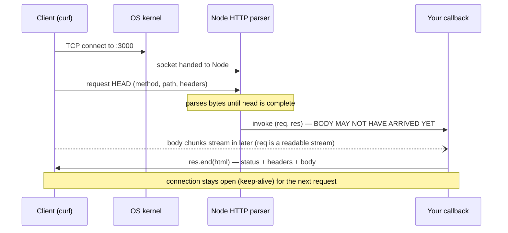

# Epoch 00 — The Primordial Server

> **You arrive with:** nothing.
> **You leave with:** a working HTTP server built from the Node.js standard library alone, serving a real HTML page — and an accurate mental model of what a "request" and a "response" physically are.

---

## 0.1 Why start this low?

Because everything you'll ever use — Fastify, Express, Next.js, NestJS — is a layer over exactly what you're about to write. When a framework misbehaves (a hanging request, a mangled header, a body that never arrives), the debugging happens *at this level*. Engineers who skipped this level debug by superstition; engineers who didn't debug by reasoning.

Also: it's about 15 lines. There is no excuse.

## 0.2 The setup

```bash
# terminal
mkdir trellis && cd trellis
git init
node --version   # must print v24.x — this course assumes Node 24 LTS
npm init -y
```

Open `package.json` and make two edits:

```json
{
  "name": "trellis",
  "type": "module",
  "scripts": {
    "dev": "node --watch server.js"
  }
}
```

- `"type": "module"` — we use **ESM** (`import`/`export`) from line one. CommonJS (`require`) is legacy; every library we'll use ships ESM, and Node's own docs default to it.
- `node --watch` — Node has a built-in file watcher since v18. You do not need `nodemon`. This is the first instance of a recurring theme: **modern Node has absorbed a lot of what used to require dependencies** (watching, testing, env files, fetch). We reach for a dependency only when the platform genuinely doesn't cover the need.

## 0.3 The server

```js
// server.js
import { createServer } from "node:http";

const server = createServer((req, res) => {
  res.statusCode = 200;
  res.setHeader("content-type", "text/html; charset=utf-8");
  res.end(`<!doctype html>
<html lang="en">
  <head><meta charset="utf-8"><title>Trellis</title></head>
  <body>
    <h1>Trellis</h1>
    <p>Tasks for teams. Eventually.</p>
  </body>
</html>`);
});

server.listen(3000, () => {
  console.log("listening on http://localhost:3000");
});
```

```bash
# terminal
npm run dev
# → listening on http://localhost:3000
curl -i http://localhost:3000
```

```
HTTP/1.1 200 OK
content-type: text/html; charset=utf-8
Date: ...
Connection: keep-alive
Content-Length: 160

<!doctype html>...
```

That's a real production-grade HTTP/1.1 server. Not a toy — the *same* `node:http` machinery serves billions of requests a day inside every Node framework.

## 0.4 What actually just happened

This section is the entire point of the epoch. Read it slowly.



### The socket, the parser, the callback

1. `server.listen(3000)` asks the OS to **bind** a TCP socket to port 3000 and start accepting connections. Ports below 1024 need elevated privileges — one reason apps run on 3000/8080 and let a load balancer own port 443.
2. When a client connects, the OS hands Node a socket. Node's built-in HTTP parser reads bytes off that socket until it has a complete *request head* (method, path, headers).
3. **Only then** does your callback run, with two objects:
   - `req` — an `IncomingMessage`. Crucially, it is a **readable stream**. When your callback fires, the *body has usually not arrived yet*. The headers have; the body is still bytes in flight. This single fact explains 80% of "why is my body undefined" confusion later.
   - `res` — a `ServerResponse`, a **writable stream**. `res.end()` writes the final bytes and (for keep-alive connections) makes the socket available for the next request on that connection.

### One thread, many requests

Node runs your JavaScript on **one thread**. Concurrency comes from the **event loop**: while the OS waits on network I/O, Node runs other callbacks. Ten thousand idle connections cost almost nothing; one `while(true) {}` in a handler freezes *every* request on the process. Two consequences you'll carry through the whole course:

- **Never block.** CPU-heavy work (hashing, compression, huge JSON) needs care — we'll meet `argon2` (which uses a thread pool) in Epoch 04 and worker processes in Epoch 09.
- **Throughput is about waiting well.** Most backend time is spent waiting on databases and networks. Architecture is largely the art of waiting efficiently and failing predictably. (Epoch 08 makes this quantitative.)

### `Connection: keep-alive`

Notice the response header. HTTP/1.1 reuses TCP connections across requests by default. This is why "graceful shutdown" (Epoch 08) is nontrivial: when you stop a server, there are live sockets mid-conversation, and slamming them drops user requests.

## 0.5 💥 Break it yourself

Do these now. Each takes one minute and buys you a permanent intuition.

1. **The hang.** Comment out `res.end(...)` and leave only `res.statusCode = 200`. Run `curl http://localhost:3000`. It hangs forever. *A response is not sent until you end it.* Every "my request spins forever" bug is some path through your code that never reaches an `end()`. Frameworks exist largely to make un-ended responses hard to write.
2. **The double send.** Call `res.end("one")` then `res.end("two")`. Check the terminal: `ERR_STREAM_ALREADY_FINISHED` (Node 24 emits an error; older code silently ignored it). Later, "headers already sent" errors are this same bug wearing framework clothes: two code paths both trying to respond.
3. **The block.** Add `for (let i = 0; i < 5e9; i++);` at the top of the handler. Open two terminals and `curl` from both. The second request waits for the first's loop to finish — you've observed single-threadedness directly.
4. **The port collision.** Start the server twice. `EADDRINUSE`. Ports are an OS-level exclusive resource; this error will greet you for the rest of your career, now you know what it means.

## 0.6 🛡️ Guardrails already worth having

Even a 15-line server deserves three habits:

```js
// server.js (additions)
const PORT = Number(process.env.PORT ?? 3000);

server.listen(PORT, () => {
  console.log(`listening on http://localhost:${PORT}`);
});

process.on("SIGINT", () => {
  server.close(() => process.exit(0));
});
```

- **Port from the environment.** Hosts (Docker, Heroku-likes, k8s) tell your app where to listen via `PORT`. Hard-coding it is the first "works locally, dies in prod" bug.
- **`charset=utf-8` in content-type.** Without it, some clients guess encodings and mangle non-ASCII text. State encodings; never let clients guess.
- **Close on SIGINT.** `server.close()` stops accepting new connections and lets in-flight ones finish. This is the seed of graceful shutdown; it becomes load-bearing when a deploy sends SIGTERM in Epoch 08/11.

## 0.7 ⚖️ Decision log for this epoch

| Decision | Alternatives rejected | Why |
|---|---|---|
| Raw `node:http`, no framework | Express, Fastify, Hono | No pain yet to justify one. You cannot evaluate a framework's value until you've felt the problems it solves. (That's Epoch 01's job.) |
| ESM from day one | CommonJS | ESM is the standard, the ecosystem default, and what all our later tooling assumes. Mixing module systems later is misery; starting right is free. |
| `node --watch`, zero dependencies | nodemon | The platform covers it. Fewer deps = smaller attack surface, faster installs, less to audit (Epoch 11 cares a lot). |

## 0.8 Checkpoint

You're ready for Epoch 01 if you can answer:

1. When your request handler starts executing, has the request *body* arrived? What kind of object is `req`, and why does that answer the question?
2. Why does a response hang forever if you never call `res.end()` — and what does that imply about error-handling code paths?
3. Why does one CPU-bound loop freeze *all* concurrent requests? What kinds of work are therefore dangerous in a handler?
4. Why must `PORT` come from the environment?

---

*Next: the moment you add a second page, you need routing — and hand-rolling it will teach you exactly what frameworks are for. → [Epoch 01: Routing by Hand & the Limits of DIY](epoch-01-routing-by-hand.md)*
