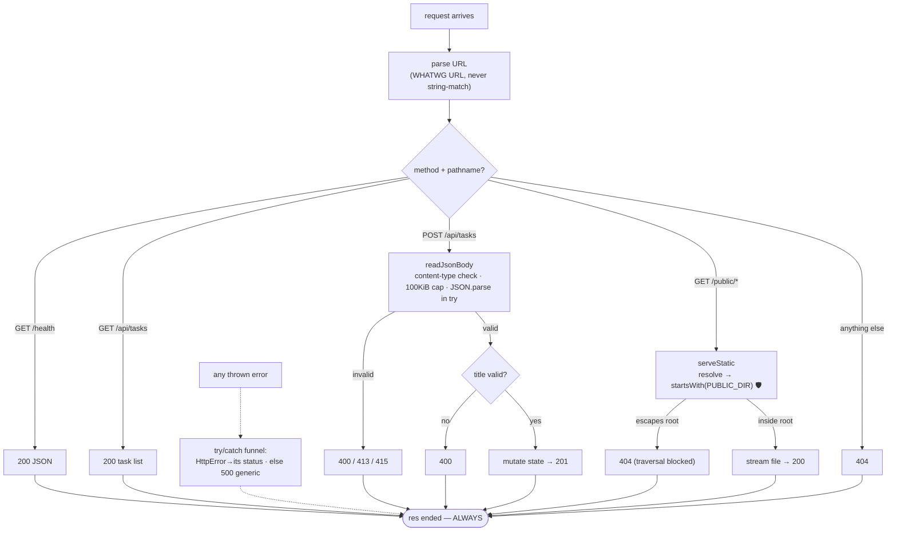

# Epoch 01 — Routing by Hand & the Limits of DIY

> **You arrive with:** one server, one response.
> **You leave with:** a hand-rolled router, static file serving, JSON request bodies — and a precise, earned list of the problems that justify adopting a framework.

---

## 1.1 The pain

Trellis needs more than a landing page. It needs:

- `GET /` — the HTML page
- `GET /health` — a probe for load balancers (you'll thank yourself in Epoch 08)
- `GET /api/tasks` — list tasks as JSON
- `POST /api/tasks` — create a task from a JSON body
- `GET /public/*` — CSS and images

One callback receives *every* request. Structure has to come from somewhere. Today, we build it ourselves — not out of masochism, but because every line of this epoch is a requirement you'll later see a framework satisfy. **You can't judge what you haven't priced.**

## 1.2 Parsing the URL

`req.url` is a raw string like `/api/tasks?done=true#x`. Never string-match it directly — query strings and fragments will betray you. Use the WHATWG `URL` parser:

```js
// server.js
import { createServer } from "node:http";

const server = createServer((req, res) => {
  const url = new URL(req.url, `http://${req.headers.host ?? "localhost"}`);
  // url.pathname → "/api/tasks"      url.searchParams.get("done") → "true"
  router(req, res, url);
});
```

Note the base argument: `req.url` is only a *path*, so `new URL` needs an origin to parse against. (The `host` header will matter enormously in Epoch 06 — it's one way tenants are identified.)

## 1.3 A router, a store, and two endpoints

In-memory storage is fine for now — its loss-of-data pain is the entire motivation for Epoch 03.

```js
// server.js (continued)
import { randomUUID } from "node:crypto";

const tasks = new Map(); // id → { id, title, done }

async function router(req, res, url) {
  try {
    if (req.method === "GET" && url.pathname === "/health") {
      return sendJson(res, 200, { status: "ok" });
    }
    if (req.method === "GET" && url.pathname === "/api/tasks") {
      return sendJson(res, 200, [...tasks.values()]);
    }
    if (req.method === "POST" && url.pathname === "/api/tasks") {
      const body = await readJsonBody(req);
      if (typeof body?.title !== "string" || body.title.trim() === "") {
        return sendJson(res, 400, { error: "title (non-empty string) is required" });
      }
      const task = { id: randomUUID(), title: body.title.trim(), done: false };
      tasks.set(task.id, task);
      return sendJson(res, 201, task);
    }
    if (req.method === "GET" && url.pathname.startsWith("/public/")) {
      return serveStatic(res, url.pathname);
    }
    if (req.method === "GET" && url.pathname === "/") {
      return serveStatic(res, "/public/index.html");
    }
    sendJson(res, 404, { error: "not found" });
  } catch (err) {
    if (err instanceof HttpError) {
      return sendJson(res, err.status, { error: err.message });
    }
    console.error(err);
    sendJson(res, 500, { error: "internal server error" });
  }
}

function sendJson(res, status, data) {
  const payload = JSON.stringify(data);
  res.writeHead(status, {
    "content-type": "application/json; charset=utf-8",
    "content-length": Buffer.byteLength(payload),
  });
  res.end(payload);
}

class HttpError extends Error {
  constructor(status, message) {
    super(message);
    this.status = status;
  }
}
```

Three deliberate details:

- **The whole router is wrapped in one `try/catch` that always responds.** Remember Epoch 00's hanging request: an exception that escapes your handler means `res.end()` never runs. Every framework's "error handling middleware" is this block, generalized.
- **`201` for creation, `400` for a bad body.** Status codes are your API's contract; sloppy codes force clients to parse error strings.
- **Validation happened before any state change.** Trivial here; a load-bearing principle forever.

## 1.4 Reading a JSON body — the honest version

Here is the code most tutorials get dangerously wrong:

```js
// server.js (continued)
const MAX_BODY_BYTES = 1024 * 100; // 100 KiB is plenty for JSON APIs

function readJsonBody(req) {
  return new Promise((resolve, reject) => {
    const type = req.headers["content-type"] ?? "";
    if (!type.startsWith("application/json")) {
      return reject(new HttpError(415, "content-type must be application/json"));
    }
    let size = 0;
    const chunks = [];
    req.on("data", (chunk) => {
      size += chunk.length;
      if (size > MAX_BODY_BYTES) {
        reject(new HttpError(413, "body too large"));
        req.destroy();
        return;
      }
      chunks.push(chunk);
    });
    req.on("end", () => {
      try {
        resolve(JSON.parse(Buffer.concat(chunks).toString("utf8")));
      } catch {
        reject(new HttpError(400, "invalid JSON"));
      }
    });
    req.on("error", reject);
  });
}
```

🛡️ **The size limit is not optional.** Without it, any anonymous client can `POST` a 10 GB body and your process will faithfully buffer it into memory until it dies. This is the simplest denial-of-service there is, and unbounded-body-buffering has shipped in real production systems more times than anyone admits. Every framework has a `bodyLimit` setting; now you know what it's guarding.

🛡️ **`JSON.parse` in a try.** Client input is hostile by default. `{"title": ` is one truncated upload away.

🛡️ **`req.on("error")`.** Sockets die mid-body (mobile clients, closed laptops). Without this listener the error is unhandled and, since Node 15, an unhandled rejection **crashes the process**.

## 1.5 Static files — and your first security vulnerability

```js
// server.js (continued)
import { createReadStream } from "node:fs";
import { stat } from "node:fs/promises";
import path from "node:path";

const PUBLIC_DIR = path.resolve("./public");
const MIME = {
  ".html": "text/html; charset=utf-8",
  ".css": "text/css; charset=utf-8",
  ".js": "text/javascript; charset=utf-8",
  ".png": "image/png",
  ".svg": "image/svg+xml",
};

async function serveStatic(res, pathname) {
  const relative = pathname.replace(/^\/public\//, "").replaceAll("\0", "");
  const filePath = path.resolve(PUBLIC_DIR, relative === "" ? "index.html" : relative);

  // 🛡️ THE path traversal check
  if (!filePath.startsWith(PUBLIC_DIR + path.sep) && filePath !== PUBLIC_DIR) {
    throw new HttpError(404, "not found");
  }

  let info;
  try {
    info = await stat(filePath);
  } catch {
    throw new HttpError(404, "not found");
  }
  if (!info.isFile()) throw new HttpError(404, "not found");

  res.writeHead(200, {
    "content-type": MIME[path.extname(filePath)] ?? "application/octet-stream",
    "content-length": info.size,
  });
  createReadStream(filePath).pipe(res);
}
```

💥 **Break it yourself.** Comment out the traversal check and run:

```bash
# terminal — note --path-as-is, curl normalizes ../ by default
curl --path-as-is "http://localhost:3000/public/../server.js"
curl --path-as-is "http://localhost:3000/public/../../../../etc/passwd"
```

Without the check, the first command serves **your server's source code** and the second, on many systems, the OS user database. `../` in a URL, joined naively onto a directory, escapes it. This is **path traversal (CWE-22)**, it is decades old, and it still ships constantly. The fix is exactly what's above: resolve to an absolute path, then verify it's still inside the allowed root. (`path.resolve` beats string concatenation because it normalizes `..` *before* the check.)

Also note **`createReadStream(...).pipe(res)`**: the file streams to the socket chunk by chunk. `readFile` into memory would work for a 3 KB CSS file and fall over on a 3 GB video — streams are how Node moves large data with small memory. This is the same stream concept from Epoch 00, now doing real work.

## 1.6 The shape we just built, in one picture

Every framework you'll ever meet is this flowchart with better ergonomics — including the property that **every path ends in a response**:



## 1.7 The reckoning: what this epoch actually taught

Run the app; it genuinely works. Now audit what it cost. To add *five endpoints* we hand-wrote:

| Need | Our version | The problem with it |
|---|---|---|
| Routing | `if` chains on method + pathname | No path params (`/api/tasks/:id` needs regex or split-and-pray); O(n) matching; ordering bugs |
| Body parsing | 30 lines with limits and error events | Every service re-invents it, and most re-inventions forget the size limit |
| Validation | Inline `typeof` checks | Doesn't scale past 2 fields; no reusable schemas; no automatic 400s; drifts from docs |
| Error handling | One `try/catch` + `HttpError` | Works only if *every* async path funnels through it; one stray un-awaited promise escapes it |
| Static files | 40 lines incl. a CVE-class trap | Real servers also need ETags, range requests, cache headers, compression |
| Logging | `console.error` | No request correlation, no levels, no structure — unusable at any scale (Epoch 10) |

None of this was wasted: these six rows are the **evaluation checklist for any web framework**, and you now own it from experience. A framework is not magic — it is this table, written by people who've been burned longer than you, hardened by a decade of issues.

## 1.8 ⚖️ Decision log

| Decision | Alternatives | Why |
|---|---|---|
| Hand-rolled router *this epoch only* | Adopting a framework immediately | The pain is the curriculum. Also true in real life: a service with 2 endpoints and no team may not need a framework. |
| `Map` for storage | SQLite, files, Postgres now | One pain at a time. Persistence deserves its own epoch (03), not a footnote. |
| Manual 100 KiB body cap | No cap | Unbounded buffering of client input is a self-inflicted DoS. This number survives into our framework config later. |

## 1.9 Checkpoint

1. Why must the body reader enforce a byte limit *while chunks arrive*, rather than checking `content-length` alone? (Hint: is the header trustworthy? Is it even required?)
2. Explain path traversal to a rubber duck: what does `path.resolve(PUBLIC_DIR, "../etc/passwd")` return, and why does the `startsWith` check stop it?
3. Which failure in this epoch's code would *crash the whole process*, and which would merely hang one request?
4. Name three things in the reckoning table you'd refuse to hand-maintain in a 30-endpoint service.

---

*Next: we adopt a framework with a precise shopping list — and immediately raise the bar on validation, errors, config, and structure. → [Epoch 02: The MVP](epoch-02-the-mvp.md)*
