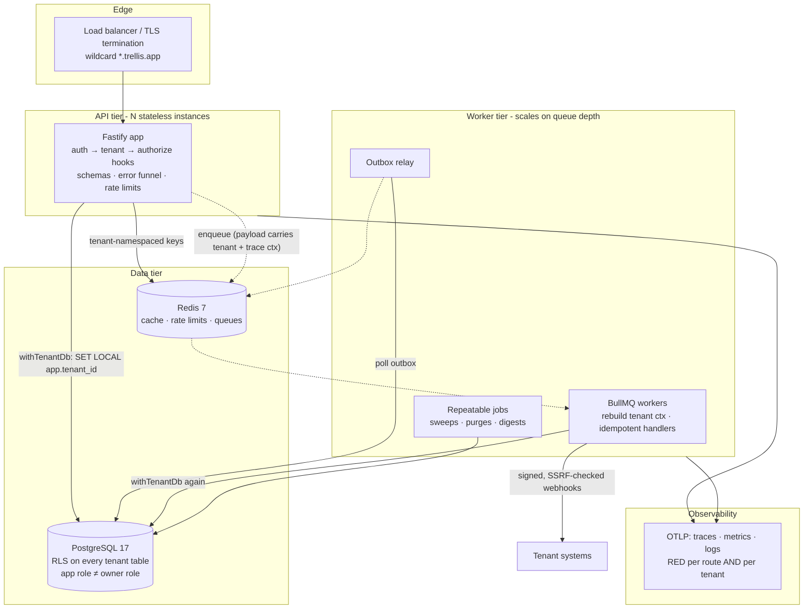

# Epoch 12 — The Capstone Architecture

> **You arrive with:** twelve epochs of accumulated decisions.
> **You leave with:** the whole system on one page — the diagram, the final tree, one request traced through every layer, the complete decision log, and the honest roadmap for the day 1× becomes 10×.

---

## 12.1 The system, on one page



Every box exists because some epoch's pain demanded it. If you can narrate that pain for each box, the course worked.

## 12.2 The final tree

```
trellis/
├── src/
│   ├── server.ts            # entry: config, listen, signals, shutdown order   (Ep. 00/02/08)
│   ├── app.ts               # buildApp(): plugins, hooks, routes, error funnel (Ep. 02)
│   ├── config.ts            # ALL env access — validated, frozen, two DB URLs  (Ep. 02/07/11)
│   ├── context.ts           # AsyncLocalStorage: reqId, user, tenant           (Ep. 06)
│   ├── logging.ts           # pino + ALS mixin + central redaction             (Ep. 10)
│   ├── otel.ts              # tracing/metrics bootstrap                        (Ep. 10)
│   ├── plugins/
│   │   ├── auth.ts          # deny-by-default session gate                     (Ep. 04)
│   │   ├── tenant.ts        # subdomain → membership → req.tenant              (Ep. 06)
│   │   └── authorize.ts     # requireRole()                                    (Ep. 06)
│   ├── routes/              # HTTP ↔ domain translation, nothing else          (Ep. 02/03)
│   ├── services/            # business logic, pure where possible              (Ep. 04/05)
│   ├── repositories/        # factories taking db — THE seam                   (Ep. 03/05/06/07)
│   ├── db/
│   │   ├── schema.ts        # Drizzle schema; tenant_id + leading indexes      (Ep. 05/06)
│   │   ├── pool.ts          # sized, timed, error-handled                      (Ep. 03/08)
│   │   └── tenant-db.ts     # withTenantDb: BEGIN + set_config + RLS           (Ep. 07)
│   ├── cache.ts             # cache-aside, TTL, tenant-namespaced              (Ep. 08)
│   └── jobs/
│       ├── queues.ts        # definitions + enqueue helpers (ctx into payload) (Ep. 09)
│       ├── worker.ts        # separate process; drain on SIGTERM               (Ep. 09)
│       └── handlers/        # idempotent, tenant-revalidating                  (Ep. 09)
├── migrations/              # ordered, reviewed, expand/contract               (Ep. 03/11)
├── test/
│   ├── tenant-isolation.test.ts   # the crown jewels + RLS meta-test           (Ep. 06/07)
│   └── ...                  # integration vs real Postgres; unit beside code   (Ep. 05)
├── Dockerfile               # multi-stage, non-root, npm ci                    (Ep. 11)
├── compose.yaml             # postgres 17, redis 7                             (Ep. 03/08)
└── .github/workflows/ci.yml # red blocks merge                                 (Ep. 11)
```

## 12.3 One request, every layer

`PATCH https://acme.trellis.app/api/tasks/7ab…/done` — narrated once, end to end:

1. **Edge**: TLS terminates; LB forwards with `X-Forwarded-*`; `trustProxy` makes `req.ip` real (Ep. 11).
2. **Rate limits**: per-tenant Redis bucket — Globex's storm can't queue ahead of this request (Ep. 07/08).
3. **Parse & validate**: route schema rejects malformed bodies before any handler; `additionalProperties: false` blocks smuggled fields (Ep. 02).
4. **Auth hook**: session cookie → SHA-256 → indexed lookup → `req.user`; deny-by-default (Ep. 04).
5. **Tenant hook**: `acme` from `Host` → membership JOIN adjudicates → `req.tenant = {id, role}`; 404 hides non-membership (Ep. 06).
6. **Context**: ALS stores `{reqId, userId, tenant}` — logs, traces, and repos all read it implicitly (Ep. 06/10).
7. **Handler → service → repository**: `withTenantDb` opens a transaction, `set_config('app.tenant_id', …, true)`, and the UPDATE carries both the explicit `workspace_id` predicate *and* runs under RLS — belt and suspenders (Ep. 03/07). Zero rows ⇒ 404, indistinguishable from nonexistence (Ep. 04).
8. **Outbox**: `task.completed` event committed atomically with the update (Ep. 09).
9. **Respond**: response schema strips internal fields; 5xx would be generic, logged rich (Ep. 02).
10. **Later, elsewhere**: relay publishes → worker rebuilds tenant context, re-validates the tenant, delivers the signed webhook idempotently, with retries+jitter, DLQ behind it (Ep. 08/09).
11. **Throughout**: every hop is a span on one trace; every log line carries `reqId`+`tenantId`; RED metrics tick for route and tenant (Ep. 10).

Thirty seconds of narration; twelve epochs of reasons.

## 12.4 The complete decision log

The course's spine, in one table — *what we chose, what it cost, and when to choose differently*:

| Ep. | Decision | The price paid | Choose differently when… |
|---|---|---|---|
| 00 | Raw `node:http` first; ESM; zero deps | Slower start | Never — foundations are cheap once |
| 01 | Hand-roll routing/body/static once | A day of "wasted" code | You already deeply know the layer |
| 02 | Fastify 5; schemas; app/server split; config quarantine | Framework lock-in (mild) | Team fluency or edge runtime points elsewhere |
| 03 | Postgres; raw SQL first; repo factories over `db`; versioned migrations | SQL learning curve | Document-shaped data with no relational spine (rare) |
| 04 | argon2id; opaque hashed sessions in httpOnly/lax cookies; deny-by-default gate; 404-for-hidden | A SELECT per request | Multi-service SSO / third-party API consumers → tokens earn their keep |
| 05 | Native TS stripping; strict; Drizzle; `node:test`; real-DB integration tests | CI needs services | Prisma/Vitest are fine equivalents — the *policies* are the point |
| 06 | Shared schema + `tenant_id`; memberships M:N; subdomain+membership resolution; ALS context | Isolation is logical only (until 07) | Few/huge/regulated tenants → schema- or db-per-tenant |
| 07 | RLS + `SET LOCAL` via `set_config`; split db roles; hostile tests + meta-test; lifecycle & purge inventory | ~small % query overhead; raw-SQL migration care | Non-Postgres stores need the wrapper-layer equivalent, watched closely |
| 08 | Deadlines everywhere; drain-shutdown; live≠ready; cache-aside+TTL+tenant keys; jitter; idempotent-only retries | Config surface | Never — this epoch is the weatherproofing |
| 09 | BullMQ workers; payload-carried context; idempotency keys; outbox for critical events; signed SSRF-checked webhooks | A table, a relay, ops attention | Modest scale → Postgres `SKIP LOCKED` queue, same concepts |
| 10 | pino+ALS+redaction; OTel; RED per route *and* tenant; symptom paging; SLOs | Telemetry cost (sampled) | Never the pillars; vendors are interchangeable |
| 11 | Multi-stage non-root images; red-blocks-merge CI; expand/contract; rotate-never-rewrite; rehearsed restores | Process discipline | Never — this is the difference between built and shipped |

## 12.5 The 10× roadmap

The most senior sentence in the course: **this architecture is correct for its scale, and knows what its next three bottlenecks are.** Premature distribution is how five-service startups die with three users; the skill is knowing the order of the walls and the doors already cut in them:

1. **Database read pressure** (first wall, usually). Doors already cut: indexes/EXPLAIN reflexes (03), cache-aside (08). Next: read replicas — and the new problem is replication lag (read-your-own-writes routing), which the repository seam localizes.
2. **Connection arithmetic** at high instance count (03's math): PgBouncer transaction mode — `withTenantDb` was built compatible on purpose (07).
3. **Hot tenants** (the whale problem): per-tenant meters (07) find them; the promotion lane (06's hybrid note) moves them to dedicated resources *without an app rewrite* — the repository seam again. Sharding by tenant is the same idea generalized: tenant id is already on every row, every key, every job payload. **Multitenancy done right is pre-sharding.**
4. **Team scaling** (the real reason for microservices, when it's real): the modular monolith — routes/services/repos per domain — splits along module seams *if and when* independent deploy cadence or fault domains demand it, carrying the outbox (09) as the inter-service event backbone it was always secretly practicing for. Extracting a service from a well-seamed monolith is a quarter's work; distributed-first with fuzzy boundaries is a permanent tax.
5. **What never changes at any scale**: validated boundaries, deny-by-default, tenancy predicates in the store, idempotent effects, symptom-based paging, red-blocks-merge. These are load-bearing at 10 users and at 10 million.

## 12.6 The exit exam

No answers provided — that's the point. You're done with the course when these are *easy*:

1. A new engineer proposes "we can drop `withTenantDb` in this internal admin endpoint, it's trusted." Write the two-paragraph review comment, citing layers and failure modes by name.
2. Design the "promote Globex to a dedicated database" runbook: what moves, what doesn't change (and *why* it doesn't — name the seam), what the cutover step is, and what proves success.
3. Latency p99 doubled for one tenant only. Produce the triage tree: which dashboard, which trace filter, which three most-likely causes in order, and which epoch built each probe you're using.
4. Your PM wants "sub-tenant workspaces" (departments inside a company, with their own isolation). Which decisions from Epochs 06–07 generalize cleanly, and which need rethinking?
5. Re-derive the whole course backward: start from "Acme must never see Globex's rows, even through our bugs," and show how that single requirement pulls in RLS, which pulls in transactions and roles, which pull in pooling discipline, which pulls in… keep going until you hit `res.end()`.

---

## 12.7 Where to go from here

- **Build it.** The course gave you every file's reason; typing them into a running Trellis is the difference between having read and having learned.
- **Designing Data-Intensive Applications** (Kleppmann) — the depth behind Epochs 03/08/09.
- **The SaaS tenant-isolation literature** (AWS SaaS Factory's isolation papers, Postgres RLS docs) — Epochs 06/07 at enterprise depth.
- **The Google SRE book** — Epochs 08/10/11 as a profession.
- **Release It!** (Nygard) — the failure-mode bestiary Epoch 08 sampled.

*The bare `server.js` from Epoch 00 is still in the git history. Diff it against `main` sometime — every line in between has a reason you can now recite.*

**— End of course.**
